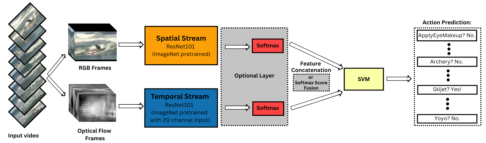
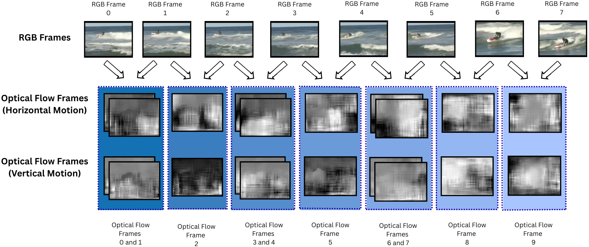

## The presented repository contains the scripts and results for the Bachelor project "At the Crossroads of Compression and Explainability: Implications in Video-Based Pruned Models".

The implemented code presents a Two-Stream action recognition model, subjected to structural channel pruning and saliency-based explanation generation. The implemented architecture can be found below.

	

The human action recognition dataset employed for this study is [UCF101](https://www.crcv.ucf.edu/data/UCF101.php), and the study experimented exclusively with the third split. The model architecture is inspired by the works of [Simonyan, K., & Zisserman, A. (2014)](#bibliography), [Feichtenhofer, C. et al. (2016)](#bibliography) and [Potter, M. et al. (2020)](#bibliography). Additionally, the UCF101 dataset and pre-trained model weights are not included in this repository, and the base directory for the project should be carefully callibrated. Furthermore, an illustrative figure of the frame extraction for each stream is presented below.

	

The project was conducted in multiple stages. As such, originally, the implemented model was tested in order to set the baseline for the two-stream model accuracy. Furthermore, Network Slimming (proposed by [Liu, Z. et al. (2017)](#bibliography)) employing iterative channel pruning is used to identify the best pruning amount for which the model could potentiall perfom better.

The impact of pruning is furthermore asessed on the model's accuracy and on the faithfulness of explanations. To verify the faithfulness of the model's predictions, we employ saliency-based techniques to generate the explanations, specifically [Vanilla-gradient](#credits-for-the-foundations-of-the-code).

Experimental results indicated that, on average, for the spatial stream, across five runs, the optimal pruning amount for better performance is when approximately 21-25\% of the connections are masked, and for the temporal stream, the pruning ratio of 4\% indicated better results. Interestingly, it seems that masking 43\% of the spatial model also had an impact on the accuracy. Another noteworthy aspect is that since the unpruned results depict that the temporal stream was overfitting, there are reasons to believe that these pruned results might be untruthful as well. Therefore, the positively impactful values of the temporal stream, according to Cohen's d, are disregarded in the evaluation of explanation faithfulness.

The evaluation of explanations was solely tested for the pruning amounts that revealed an impact on the spatial stream (21.72%, 24.86% and 43.53%), for both streams. The results of this study imply that while pruning did not improve faithfulness, it mostly maintained the baseline results, even after 43\% of the model's connections had been masked. However, findings for such an aggressive pruning amount could be untruthful since not all pruning ratios were examined, and thus, the trend was not explored in its entirety. Consequently, while the pruned models registered higher IROFAUC scores, the results were not too far apart from the baseline unpruned results. Furthermore, post-hoc analysis revealed a potential trend towards increased faithfulness for moderate pruning (21.72\%) on both streams, implying that better explanations could be achieved in such circumstances.

Overlay results of the produced explanations for the video `v_Skijet_g16_c04', of the run1 models are presented in the figure below.

	

In conclusion, the results of the present thesis indicate that pruning can have a positive effect on model accuracy and can maintain explanation quality for HAR tasks analysed on the individual streams of a two-stream video-based model.

## Bibliography
1. Simonyan, K., & Zisserman, A. (2014). Two-Stream Convolutional Networks for Action Recognition in Videos. [https://doi.org/10.48550/arXiv.1406.2199](https://doi.org/10.48550/arXiv.1406.2199)
2. Feichtenhofer, C., Pinz, A., & Zisserman, A. (2016). Convolutional Two-Stream Network Fusion for Video Action Recognition. [https://doi.org/10.48550/arXiv.1604.06573](https://doi.org/10.48550/arXiv.1604.06573)
3. Potter, M., Gridley, H., Lichtenstein, N., Hines, K., Nguyen, J., & Walsh, J. (2020). Low-light Environment Neural Surveillance. [https://doi.org/10.48550/arXiv.2007.00843](https://doi.org/10.48550/arXiv.2007.00843)
4. Liu, Z., Li, J., Shen, Z., Huang, G., Yan, S., & Zhang, C. (2017). Learning Efficient Convolutional Networks through Network Slimming. [https://doi.org/10.48550/arXiv.1708.06519](https://doi.org/10.48550/arXiv.1708.06519)

## Credits for the foundations of the code:

1. Two-Stream Action Recognition model: [https://github.com/Cranial-XIX/FAMO.git](https://github.com/Cranial-XIX/FAMO.git)
2. Vanilla-gradient: [https://github.com/utkuozbulak/pytorch-cnn-visualizations?tab=readme-ov-file#gradient-visualization](https://github.com/utkuozbulak/pytorch-cnn-visualizations?tab=readme-ov-file#gradient-visualization)
3. IROF metric: [https://github.com/understandable-machine-intelligence-lab/Quantus.git](https://github.com/understandable-machine-intelligence-lab/Quantus.git)
